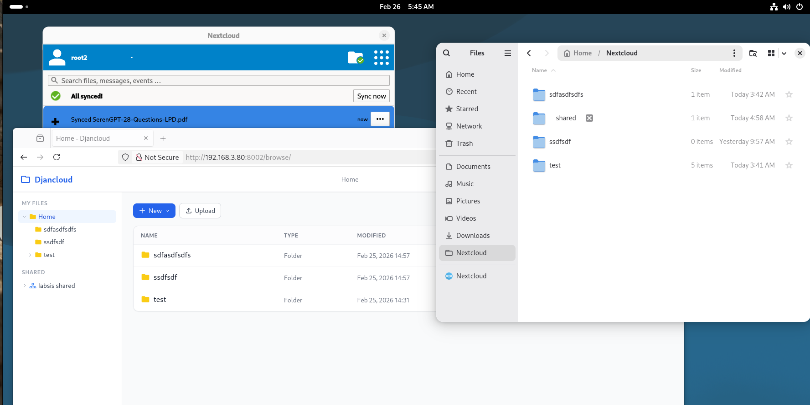

The purpose of this project is to rewrite Nextcloud server using Django. What is working so far:

- Login page, user management with simple role.
- Web UI to browse files and folders.
- Simple shared folder
- Login with official Nextcloud client and full synchronisation
- Browsable files over webdav.
- Collaborative markdown editor

What I'm planning to do:

- Probably integrate onlyoffice or collabora office
- Have shared calendar and contact

Any requests or pull requests are welcome.

    This is draft project, don't expect to have it running in production !!



# How to start with Docker Compose

```
cp .env.example .env
docker compose up --build
```

The application will be available at http://localhost:8080

To create the first admin user:

```
docker compose exec -ti web python manage.py createsuperuser
```

# How to start the development server (without Docker)

Install system packages (Debian/Ubuntu)

```
apt-get install python3 python3-pip python3-venv git nodejs npm
```

Clone this repository and create virtual env

```
git clone https://github.com/olivierb2/djan-cloud
cd djan-cloud
python3 -m venv venv
. ./venv/bin/activate
pip install -r requirements.txt
```

Build the frontend

```
cd frontend
npm install
npm run build
cd ..
```

Configure the environment

```
cp .env.example .env
```

Create database and first admin user

```
python3 manage.py migrate
python3 manage.py createsuperuser
```

Run the development server

```
python3 manage.py runserver
```
